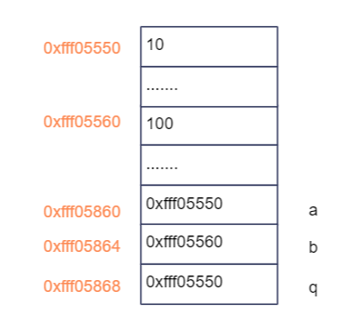
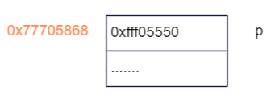

## 指针
指针是用来存内存地址的特殊变量。指针使用如下：
```c++
int a = 10;
int *p1;
p1 = &a;
int *p2 = &a;
```
> 注意
> ```c++
> //c++不允许对指针直接赋值一个内存地址，即使使用记录的地址赋值
> int *p2 = (int *)0x7ffe8dca4a2c;
> ```
### 指针的类型
任何变量都有类型，例如`int a`，变量a的类型是整形，我们可以声明指针变量`int *p`，可以理解其类型为`基本类型+*`即`int *`。

### 指针所占的内存空间
由于指针存放的是变量所占内存空间起始地址，而地址长度根据操作系统确定，32位操作系统是占4个字节，64位操作系统占8个字节。
```c++
sizeof(int *)     // int *、float *等所有指针类型都是4个字节！
sizeof(float *)
```
### const
- 指针常量：int *const p;
    无法更改指针的指向，但指针指向的值可以更改。**这个指针是个常量**。
- 常量指针：const int *p;
    指针指向的值无法更改，指针的指向可以更改。**指向常量的指针**。
> 如何记忆：
> 去掉变量类型来看，看const后面直接跟*还是p，如果const p，说明指针本身无法修改，即不能更改指向；如果const *p，说明指向的变量无法修改。

### 指针与数组

指针和数组其实关系很小，只不过二者都是用来操作内存，且使用是通常可以相关替换，故非常容易混肴。

其实，指针就是指针变量，是在内存堆区或栈区开辟空间用了存放该变量。然而，数组其实指的是一块内存空间，数组并没有所谓的存储在内存中的“数组变量”，数组名就是为了给一块内存空间命名而已！

所以数组名不是指针！在32-bit系统中，有：

```c++
int *p;
int array[10];
printf("指针的大小:%d", sizeof(p));    // 4，一个指针占标准的4个字节。
printf("数组的大小:%d", sizeof(array); // 40，这块内存区域的大小
```

#### 基本概念
定义一个数组：
```c++
int a[5] = {1,2,3,4,5};
```
- a作为右值，代表数组首元素的首地址，而非数组的首地址
- 编译器把这5字节的内存空间命名为a，但没有给空间内的每个元素命名，故a[0]、a[1]等不是元素的名字
- a不能作为左值，不能改变a的值，因为a是对整块内存的命名，无法对整块内存当作一个单个变量来看待和操作！
- 一旦将a作为名字给内存空间命名，就不能对其他空间命名了！
- sizeof(a)=sizeof(int)*5

重要含义：
- a: 数组首元素的首地址；
- &a[0]：取数组首元素的地址；
- &a：数组的地址；

故有：
1)a+1表示元素a[1]的地址，\*(a+1)=a[1]
2)&a+1表示下一个数组的首地址，即&a+1=a+sizeof(a)=a+sizeof(int)\*5


#### 偏移量
1. 以指针的形式和以下标的形式访问指针
```c++
int a = 10;
int *p;
```
- \*(p+4): 先取出p里面存储的地址，假设是0xff00，然后偏移4个对应类型所占的空间，即p+4\*sizeof(int)，即0xff10；
- p[4]：编译器总把以下标的形式操作解析为指针操作，故与上面相同


2. 以指针和以下标形式访问数组
```c++
int a[] = {1,2,3,4,5};
int *p = a;
```
- \*(a+4)、a[4]：a作为数组首元素的首地址，然后加上括号中4个元素的偏移量（不是4个byte），计算出新的地址，即获取内存块中首元素后第4个元素。
- \*(p+4)、p[4]：结果与上面相同

### 二级指针

如果一个外部指针作为参数传入函数中，且要在该函数中修改指针的指向，那么必须用到二级指针。

#### 举例1

**代码**

```c++
#include <iostream>
#include <string>
using namespace std;
int a = 10;
int b = 100;
int *q;
void test01(int *p)
{
    p = &b;
}
void test02(int **p)
{
    *p = &b;
}
int main(int argc, char *argv[])
{
	q = &a;
    cout << *q << endl;
    test01(q);               // 一级指针，无法修改实参指针指向
    cout << *q << endl;
    test02(&q);              // 二级指针，可以
    cout << *q << endl;
    return 0;
}
```

**结果**

根据输出结果发现test01()前后打印结果都为`*q=10`，也就是函数中改变指针的指向并没有起作用。而test02()可以。

**分析**

当三个指针初始化并且令指针p=a后，三个指针在内存中如下图：



当运行函数`func(q)`后，函数将拷贝实参q的值并赋值给形参p如下：



这里形参p作为局部变量，是创建在栈中的，只不过它也指向a，即保存了于q同样的地址而已。


但如果修改p的值，由于p和q所在地址不一样，故无法实现q的值的改变！

## 内存四区

- 代码区： 存放函数体的二进制代码，由操作系统管理
- 全局区： 存放全局变量、静态变量、字符串常量
- 栈区： 由编译器自动分配和释放，存放函数的参数值、局部变量等
- 堆区： 由程序员分配和释放

### 全局区
- 全局变量，全局常量
- 函数体内的静态变量
- 字符串常量

### 栈区

局部变量的地址不要作为函数返回值返回，因为函数返回后栈区内变量被释放！

### 堆区
由程序员分配和释放，如果程序员不释放，程序结束时由操作系统回收
在C++中主要使用new在堆区开辟内存！


### new和delete
#### 分配变量空间
```c++
int *p = new int(10);
delete b;
```

#### 分配数组空间
```c++
int *arr = new int[10];   // 创建一个10个int成员的数组
delete[] arr;
```


## 引用
作用：引用就是给变量取别名。因为创建变量的时候实质上是**开辟一个内存空间存放变量，然后给这个内存取个名字**，所以当然也可以重新给这个内存取一个别名！
语法：数据类型 &别名=原名
例子：
```c++
int a=10;
int &b=a;
```
### 本质
引用本质上就是指针常量（指针的指向不能改变，但指向的对象可以变），如：
```c++
int &b = a;
//等同于
int *const b = &a;
```
### 使用要求
引用必须初始化时赋值
引用一旦初始化，就不可以更改


### 引用做函数参数
函数传参时，可以利用引用，让行参修饰实参，可以避免指针操作

### 引用作为返回值

```c++
int& test02()
{
    static int a = 10;       // 静态变量，全局区
    return a;
}
int main(int argc, char *argv[])
{
    int &ref2 = test02();
    cout << "ref2=" << ref2 << endl;

    test02() = 1000;                        // 作为左值
    cout << "ref2=" << ref2 << endl;
    return 0;
}
```


