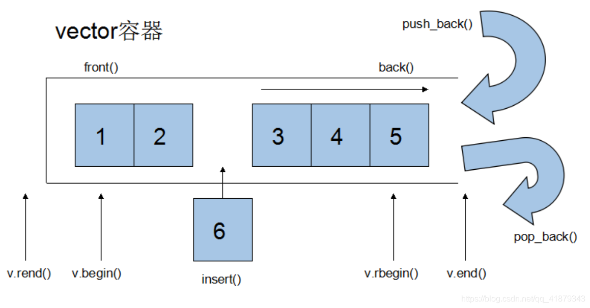

# STL

## STL简介

STL（Standard Template Library，标准模板库），广义上分为容器（container）、迭代器（iterator）、算法（algorithm）。

**容器**和**算法**通过**迭代器**进行无缝连接。

## 迭代器

iterator

const_iterator


## string

string与char *区别

- char*是一个指针
- string是一个类，类内封装了char*

成员函数

- assign       //赋值
- find           //查找，查找第一次出现的位置
- rfind         //查找，查找最后一次出现的位置
- replace    //替换
- append    // 
- at              //
- compare  //比较
- insert
- erase
- substr

### 构造函数

- string()                                 //初始化空字符串
- string(const char* s)         //通过字符串初始化
- string(const string & str)  //拷贝构造
- string(int n, char c)            //使用n个字符c初始化

### 赋值操作

两种赋值操作，一种使用`=号重载`，一种使用`assign()`成员函数。

- string& operator=(const char* s);        //
- string& operator=(const string &s);     //
- string& operator=(char c);                     //
- string& assign(const char *s);              //
- string& assign(const char *s, n);          //将s的前n个字符赋给当前字符串
- string& assign(const string &s);           //把s赋给当前字符串
- string& assign(int n, char c);                 //

### 拼接

拼接就是在末尾添加新的内容，有`+=重载`和`append()`函数两种方式。

- string& operator+=(const char* str);     //
- string& operator+=(const char c);          //
- string& operator+=(const string& str);  //
- string& append(const char *s);              //
- string& append(const char *s, int n);    // 拼接s的前n个字符到当前字符串末尾
- string& append(const string &s);           //
- string& append(const string &s, int pos, int n); //拼接s中从pos位置开始的n个字符到当前字符串


### 查找

- 查找：查找指定的字符串是否存在
- 替换：在指定位置替换字符串

查找

- int find(const string& str, int pos=0) const; //从pos开始查找，查找str第一次出现的位置
- int find(const char* s, int pos=0) const; //从pos开始查找，查找s第一次出现的位置
- int find(const char* s, int pos, int n) const;  //从pos开始查找s的前n个字符第一次出现的位置
- int find(const char c, int pos=0) const; //
- int rfind(const string& str, int pos=npos) const; //从pos开始由右向左查找str出现的位置
- int rfind(const char* s, int pos=npos) const; //从最右侧开始向左查找
- int rfind(const char* s, int pos, int n) const; //从pos开始由右向左查找s的前n个字符出现的位置
- int rfind(const char c, int pos=0) const;

返回值：

- 查找到：返回查找位置
- 没查找到：返回-1，也就是**string::npos**

### 替换

- string& replace(int pos, int n, const string& str);  //从pos开始n个字符替换为字符串str

- string& replace(int pos, int n, const char* s);        //从pos开始的n个字符替换为字符串s

在替换时，如果n指的是被替换的字符数量，而并不是s/str的长度：

```shell
string str("hello world")
str.replace(6, 2, "123")    //hello 123rld
str.replace(6, 4, "123")    //hello 123d
```

### 比较

字符串比较按照字符ASCII码进行比较

= 返回0；

\> 返回大于0的值，该值是二者距离；

< 返回小于0的值；

> 实际使用时，都是判断两个字符串是否相等，判断大小的意义并不是很大

### 字符存取

- char& operator[]\(int n);         //通过下标
- char& at(int n);                        // 通过函数at

### 插入

- string& insert(int pos, const char* s);  //插入字符串
- string& insert(int pos, const string& str);
- string& insert(int pos, int n, char c);    //插入n个字符c

### 删除

- string& erase(int pos, int n=npos);  //从pos处删除n个字符

### 子串

- string& substr(int pos=0, int n=npos) const; //返回从pos开始的n个字符组成的字符串

```c++
string email("xueyuankui.good@163.com");
//"xueyuankui.good"
cout << email.substr(0, email.find("@")) << endl;
//"@163.com"
cout << email.substr(email.find("@")) << endl;
```

## vector

和数组非常相似，故称为单端数组，但不同于数组是静态的，vector可以动态扩展。

动态扩展：并不是在原空间之后续接新空间，而是找更大的内存空间，将原数据拷贝至新空间，然后释放原空间。



### 成员函数

- push_back                                        // 尾插
- pop_back                                          // 尾删

### 遍历

使用迭代器进行遍历操作。

```c++
vector<T> v;
for(vector<T>::iterator it=v.beigin(); it!=v.end(); ++it)
{
    cout << *it << endl;
}
```

> 注意，当进行插入和删除操作，会造成原有迭代器的失效

### 构造函数

- vector<T> v;                                   // 采用模板
- vector<T> v={elem1, elem2};         // 采用大括号
- vector<T> v(v.beigin(), v.end());    // 将v[begin(), end())区间内的元素拷贝给自身，注意区间是前闭后开
- vector<T> v(n, elem);                    // 将n个elem拷贝给自身
- vector<T> v(const vector &vec);   //拷贝构造

### 赋值

- vector& operator=(const vector &vec);         // 重载=号运算符
- assign(begin, end);                                       // 将v[begin(), end())区间内的元素
- assign(n, elem);                                            // 将n个elem拷贝给自身
- v = {elem1, elem2};                                       // 通过大括号赋值

### 容量和大小

- empty();                                // 判断容器是否为空
- capacity();                             // 容器的容量，动态变化的
- size();                                    // 返回容器内元素个数
- resize(int num);                     // 重新指定容器长度为num，如果变长，以默认值填充，如果变短，进行尾部删除
- resize(int num, elem);           // 重新指定容器长度为num，如果变长，以elem填充，如果变短，进行尾部删除

### 插入和删除

- push_back(elem);              
- pop_back();
- insert(const_iterator pos, elem);
- insert(const_iterator pos, int cnt, elem);
- erase(const_iterator pos);
- erase(const_iterator start, const_iterator end);
- clear();                                                                        // 清空容器

> 注意：
>
> 进行insert和erase操作时，一定要使用新的迭代器，不要使用容器经过各种变化操作前定义的迭代器
>
> ```c++
> vector<int>::iterator it = v.begin(); //定义一个迭代器
> v.insert(it, 10);
> 
> //v.erase(it);                        //错误！容器已经改变了，旧的迭代器不能再使用了
> v.erase(v.begin());                   //正确！使用新的迭代器
> ```

### 数据存取

- at(int idx);       // 利用成员函数at返回索引idx所指向的元素
- operator[];      // 索引重载
- front();            // 返回第一个元素
- back();            // 返回最后一个元素

### 容器互换

实现两个容器内所有元素的互换。

- swap(vector<T> vec)

用途：

- 使用swap可以收缩内存空间

```c++
vector<string> v(10000, "hello");
//如果capacity很大，而size很小，则可以使用swap将capacity收缩
vector<string>(v).swap(v)          // 使用拷贝构造一个匿名对象，然后进行互换，匿名对象自动被回收
```


### 预留空间

减少vector在动态扩展时的扩展次数，也就减少了拷贝次数

- reserve(int len);                        // 容器预留len个元素，预留位置不可以初始化，元素不可访问

## deque

deque(double-ended queue)是一种双端数组容器。

- 与vector相比，头部插入效率更高但遍历效率稍低


### 构造函数

- deque<T> deq;                 //默认构造函数
- deque(begin, end);           //将[begin,end)区间的元素拷贝给自身
- deque(n, elem);                //将n个elem拷贝给自身
- deque(const deque &deq); // 拷贝构造


## stack

栈，

- 先进后出

- 不支持遍历操作

### 构造函数

- stack<T> stk;                 //  默认构造
- stack(const stack &stk); // 拷贝构造

### 赋值

- stack& operator=(const stack &stk);    // 重载=号运算符

### 数据存取

- push(elem);           // 入栈，向栈顶添加元素
- pop();                     // 出栈，从栈顶移除第一个元素
- top();                      // 返回栈顶元素

- empty();                 // 判断是否为空
- size();                     // 返回栈的大小

## queue

队列，

- 先进先出

- 不支持遍历操作

### 构造函数

- queue<T> que;                 //  默认构造
- queue(const queue &que); // 拷贝构造

### 赋值

- queue& operator=(const queue &que);    // 重载=号运算符

### 数据存取

- push(elem);           // 向队尾添加元素
- pop();                     // 从队头移除第一个元素
- front();                    // 返回第一个元素
- back();                    // 返回最后元素

- empty();                 // 判断是否为空
- size();                     // 返回栈的大小

## list

链表，可以将数据进行链式存储，也就是一种在物理存储单元上非连续的存储结构，STL中的链表是一种双向循环链表。

链表由一系列的**结点**组成，每个结点包括存储数据元素的**数据域**，存储上个节点和下一个结点地址的**指针域**。

- 链表可以对任意位置进行插入、删除
- 采用动态存储分配，不会造成内存浪费和溢出
- 容器遍历速度不如数组快

List有一个重要性质，插入和删除不会造成原有list迭代器的失效。

### 构造函数

- list<T> lt
- list<T> lt={elem1, elem2};         // 采用大括号
- list(beigin, end);                         // 将迭代器区间[beigin, end)中的元素拷贝给自身
- list(n, elem);                               //将n个elem拷贝给自身
- list(const list &lt);                       //拷贝构造

## set/multiset

所有元素在插入时自动被排序。本质上就是关联式容器，底层结构是使用而叉树实现。

set与multiset的区别

- set不允许容器中有重复的元素
- multiset允许容器中有重复的元素


### 插入

- insert(elem);               


## map/multimap

- map中所有元素都是<key,value>键值对

- 所有元素在插入时都会根据元素的键值自动被排序。

本质上就是关联式容器，底层结构是使用而叉树实现。

- map不允许容器中有重复key值元素
- multimap允许容器中有重复key值元素
